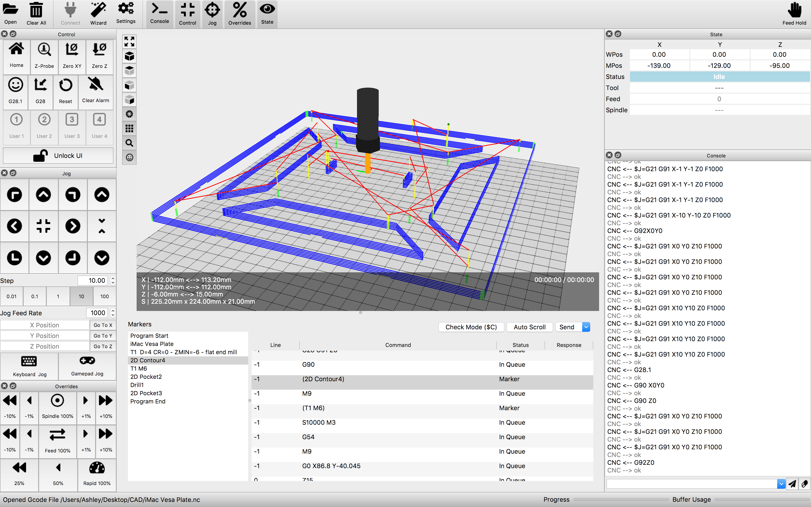

CoconutCNC
-----------
A G-Code Controller and Visualiser for GRBL Machines. 

Written in C++/Qt

Key Functions:
------------------------
* Customisable User Interface. Taylor to a Touch/Mouse Driven Experience.
* Manual Control of Your CNC via Commands, Jog Buttons and Num-Pad.
* Live Monitoring of CNC State.
* Loading, Manual Editing, Saving and Sending of G-code Files.
* Visualising G-code Tool Paths in 3D. 

Planned Features
------------------
* More Accurate Tool Models in Visualiser
* Stock & Fixtures in Visualiser
* Tool Change Alerts/Management
* Tool Path Crash Prediction (Intersecting Stock/Fixtures During Rapids)

System Requirements for Running CoconutCNC:
-------------------
* Windows/Linux/MacOS X 
* A Graphics Card with OpenGL 2.0 Support
* A GRBL Based CNC Machine
* Requires GRBL v1.1 firmware. Available here https://github.com/gnea/grbl

Build Requirements:
------------------
* Build with Qt 5.10 or above.

Credits:
------------
* Huge Thanks go to the developers/contributers of Candle, the basis of CoconutCNC. https://github.com/Denvi/Candle.git
* Using Icons from FontAwesome https://fontawesome.com
